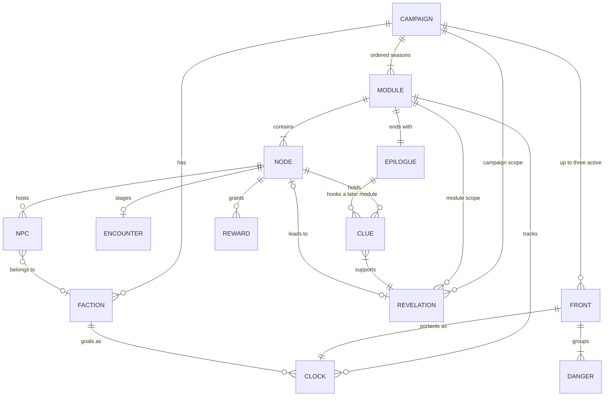

# Campaigns and modules a program can generate and check

A research brief for the Portale campaign tool. Written 2026-09-25.

## How to read this

Every factual claim links to a page I read during this research. Scripts re-fetched the pages behind the load-bearing claims and confirmed the quoted wording (see [Verification](#verification)). Three marks carry meaning.

- **[Inference]** marks my own reasoning from the sources. No source makes that claim.
- **Support grades** on rules. **A** means a primary source states it as a rule or a required procedure. **B** means a primary source offers it as a guideline or example, or two or more independent practitioners converge on it. **C** means my inference from sourced reasoning. **F** means folklore. The idea circulates, but I found no source for the specific claim or number.
- **(secondary)** marks a source that reports someone else's work, such as fan notes, a wiki, or a review.

Commercial books (the 2024 Dungeon Master's Guide, Mythic, Scarlet Heroes) are described, never copied. Where the book itself was paywalled I relied on the publisher's own articles about it and say so.

## The short version

The sources agree on a hierarchy of play and on one design stance. The hierarchy runs campaign, adventure, session, scene, and action. The official 2024 rules map it onto television, with the campaign as the series, the adventure as a season, and the session as an episode ([D&D Free Rules 2024](https://www.dndbeyond.com/sources/dnd/br-2024/playing-the-game)). The stance is to prep situations, not plots ([The Alexandrian, Don't Prep Plots](https://thealexandrian.net/wordpress/4147/roleplaying-games/dont-prep-plots)). A module is a graph of nodes joined by clues, with pressure that moves on its own (fronts and clocks) and a finale whose outcome the player decides.

The rules with real support are about the clue graph (the Three Clue Rule and its inversion), combat budgets (the XP table in the CC-BY SRD 5.2.1), and threading a season arc through self-contained modules (Jason Mittell's account of the *Buffy* "big bad" season, the Alexandrian's meta-scenarios, and the 2024 DMG's serialized campaigns). Templates for locations and NPCs have converging practitioner support. Fixed difficulty curves, pillar ratios, and "one magic item per session" are folklore. For generation, the evidence points one way. Deterministic code builds the skeleton and every cross-reference, a small model fills short local text under a schema, and a validator plus a human check the result. A 3B model is a text filler, not a planner.

## 1. The structural model

### 1.1 The hierarchy the sources share

- The Angry GM nests play as action, encounter, act, adventure, arc, and campaign, with act and arc optional ([The Angry GM](https://theangrygm.com/four-things-youve-never-heard-of-that-make-encounters-not-suck/)).
- The 2024 Free Rules say a campaign "is like a TV series, while an adventure is like a season of the series," and a session is "like a single episode" that "usually links to the larger plot" ([D&D Free Rules 2024](https://www.dndbeyond.com/sources/dnd/br-2024/playing-the-game)). That is the user's framing, stated by the publisher.
- Chapter 5 of the 2024 DMG builds a campaign in four steps (Lay Out the Premise, Draw in the Players, Plan Adventures, Bring It To an End), which deliberately mirror chapter 4's checklist for single adventures. It separates episodic adventures from serialized ones and gives a table of ways to connect serialized stories ([D&D Beyond on DMG chapter 5](https://www.dndbeyond.com/posts/1850-creating-your-first-campaign-using-the-2024)).
- The Alexandrian's nodes are locations, people, organizations, events, and activities. Nodes nest, so a whole dungeon or a corporation can be one node at campaign scale and a web of sub-nodes up close ([The Alexandrian, Types of Nodes](https://thealexandrian.net/wordpress/8049/roleplaying-games/node-based-scenario-design-part-9-types-of-nodes)).
- A scene is framed and has an agenda, phrased as a question the scene answers ([The Alexandrian, Pacing for the Beginning GM](https://thealexandrian.net/wordpress/49547/roleplaying-games/pacing-for-the-beginning-gm)). An encounter is "a sequence of actions that answer a dramatic question by resolving one or more conflicts" ([The Angry GM](https://theangrygm.com/four-things-youve-never-heard-of-that-make-encounters-not-suck/)).

[Inference] So a Portale module is the DMG's adventure and the user's season. An episode is a runtime unit that the engine cuts out of play, not authored content. Authoring episodes as fixed sequences would be prepping a plot.

### 1.2 The entities

| Entity | What it is | Fields a generator needs | Sources |
| --- | --- | --- | --- |
| Campaign | The series | One-sentence pitch; six truths; hub or starting location; up to three fronts; campaign revelations with their answers; episodic or serialized; a long-term vow; the ending | [LGMRD spiral campaigns](https://slyflourish.com/lazy_gm_resource_document.html); [DMG ch. 5 article](https://www.dndbeyond.com/posts/1850-creating-your-first-campaign-using-the-2024); [Ironsworn SRD](https://tedtschopp.github.io/Ironsworn-SRD/Ironsworn%20SRD.html) |
| Module (season) | One adventure | Premise; level band; party assumption; inciting-incident vow; hooks; strong start node; node graph; revelations; clues; clocks; adventure fronts; encounters; rewards; finale with resolutions; epilogue; hooks into later modules | [DMG sample adventures article](https://www.dndbeyond.com/posts/1848-journey-through-these-5-short-adventures-in-the); [5 Node Mystery](https://thealexandrian.net/wordpress/37903/roleplaying-games/5-node-mystery); [5 Room Dungeons](https://www.roleplayingtips.com/5-room-dungeons/) |
| Episode (session) | A sitting | Runtime only: cold open, recap, scene count, closing beat | [Free Rules 2024](https://www.dndbeyond.com/sources/dnd/br-2024/playing-the-game); [Sly Flourish, episodic games](https://slyflourish.com/running_episodic_games.html) |
| Node | A point of interest | Kind (location, person, organization, event, activity); dramatic question; contents; proactive trigger; sub-nodes | [Types of Nodes](https://thealexandrian.net/wordpress/8049/roleplaying-games/node-based-scenario-design-part-9-types-of-nodes); [Proactive Nodes](https://thealexandrian.net/wordpress/51295/roleplaying-games/running-mysteries-proactive-nodes) |
| Location | A place with exits | Name; short description; three fantastic aspects; three or more interactive elements, or "empty" with one flavor detail; exits; loops | [LGMRD eight steps](https://slyflourish.com/lazy_gm_resource_document.html); [Awesome Dungeon Rooms](https://thealexandrian.net/wordpress/47256/roleplaying-games/random-gm-tip-awesome-dungeon-rooms); [Xandering techniques](https://thealexandrian.net/wordpress/13103/roleplaying-games/xandering-the-dungeon-part-2-xandering-techniques) |
| NPC | A person worth prepping | Name, connection to the adventure, archetype; appearance (one to three sentences); one-sentence quote; two or three roleplaying bullets with a physical mannerism; background; key info; stat block; want | [LGMRD](https://slyflourish.com/lazy_gm_resource_document.html); [Universal NPC Roleplaying Template](https://thealexandrian.net/wordpress/37916/roleplaying-games/universal-npc-roleplaying-template); [DW fronts](https://www.dwsrd.org/gm/fronts.html) |
| Faction | An organization with an agenda | Tier (0 to VI); hold (weak or strong); status with the PC (-3 to +3); goal clocks | [Blades faction game](https://bladesinthedark.com/faction-game); [Blades downtime](https://bladesinthedark.com/downtime-activities-play) |
| Front and danger | Pressure that advances without the PC | Two or three dangers, each with a type, an impulse, and an impending doom; grim portents in a logical order (one to three for an adventure front, three to five for a campaign front); one to three stakes questions; a cast | [Dungeon World SRD, Fronts](https://www.dwsrd.org/gm/fronts.html) |
| Clock | Visible or secret pressure | 4, 6, or 8 segments; named for the obstacle, not the method; kind (danger, racing, linked, mission, tug-of-war, long-term project, faction) | [Blades progress clocks](https://bladesinthedark.com/progress-clocks) |
| Revelation | A conclusion the player should reach | Statement; scope (module or campaign); either a lead to a node or a solution | [Three Clue Rule](https://thealexandrian.net/wordpress/1118/roleplaying-games/three-clue-rule); [Revelation Lists](https://thealexandrian.net/wordpress/40978/roleplaying-games/random-gm-tip-using-revelation-lists) |
| Clue | One way to reach a revelation | One short sentence; the revelation it serves; delivery (static, flexible, proactive, reactive); the node that holds it, if any; the check that gates it, if any | [Making Clues](https://thealexandrian.net/wordpress/46338/roleplaying-games/random-gm-tips-making-clues); [LGMRD secrets and clues](https://slyflourish.com/lazy_gm_resource_document.html) |
| Encounter | A scene with conflict | Node; objective; dramatic question; conflict sources; difficulty (Low, Moderate, High); creatures; XP budget; approaches | [SRD 5.2.1](https://media.dndbeyond.com/compendium-images/srd/5.2/SRD_CC_v5.2.1.pdf); [DMG encounters article](https://www.dndbeyond.com/posts/1901-creating-combat-encounters-using-the-new-dungeon) |
| Hook | Why the PC goes | The question, a reason to care, a call to action; optionally tied to earlier continuity | [Angry GM, awesome encounters](https://theangrygm.com/how-to-build-awesome-encounters/); [Long-Term Scenario Hooks](https://thealexandrian.net/wordpress/48353/roleplaying-games/random-gm-tip-long-term-scenario-hooks) |
| Strong start | The opening scene | Starts in or near action | [LGMRD](https://slyflourish.com/lazy_gm_resource_document.html) |
| Reward | What the PC gains | Kind (item, gold, level, lore, bond); tier; the clue it carries, if any | [Free Rules magic items](https://www.dndbeyond.com/sources/dnd/br-2024/magic-items); [5 Room Dungeons](https://www.roleplayingtips.com/5-room-dungeons/) |
| Finale | The conclusion node | Climax; at least a success and a failure resolution, each with world-state effects | [Angry GM, start at the end](https://theangrygm.com/lets-start-at-the-very-end/); [5 Node Mystery](https://thealexandrian.net/wordpress/37903/roleplaying-games/5-node-mystery) |
| Epilogue | What carries forward | Outcome per resolution; world changes; hooks into the next module | [5 Room Dungeons](https://www.roleplayingtips.com/5-room-dungeons/); [Mittell, Ends](https://mcpress.media-commons.org/complextelevision/ends/) |
| Legacy | Succession after death | Legacy tracks (quests, bonds, discoveries); inheritance options | [Starforged, Continue a Legacy](https://rsek.github.io/starforged-srd/moves/legacy) |

Some details behind the table:

- The Alexandrian names six clue types: static, flexible, proactive, reactive, dynamic, and unassigned. Dynamic and unassigned clues are improvised at the table ([Making Clues](https://thealexandrian.net/wordpress/46338/roleplaying-games/random-gm-tips-making-clues)). [Inference] Portale's DM may only reveal what is in the player's room (`README.md`), so authored data needs only the first four.
- Sly Flourish writes secrets as single short sentences kept "abstract from their place of discovery," about ten per session ([LGMRD](https://slyflourish.com/lazy_gm_resource_document.html)).
- The Alexandrian's NPC template has Name, Appearance (one to two sentences is the sweet spot, three the maximum), Quote (one sentence), Roleplaying (two or three bullets, with at least one physical action), Background, Key Info (bullets), and Stat Block. Mike Mearls's earlier version, which the template grew from, also had Goals ([Universal NPC Roleplaying Template](https://thealexandrian.net/wordpress/37916/roleplaying-games/universal-npc-roleplaying-template)).
- Ironsworn starts play with two vows, "a long term goal (your background vow) and an immediate situation which must be dealt with (your inciting incident)" ([Ironsworn SRD](https://tedtschopp.github.io/Ironsworn-SRD/Ironsworn%20SRD.html)). [Inference] That pair is the campaign arc and the module arc for one character.
- The 2024 DMG suggests preparing three distinct major conflicts and using the tiers of play (levels 5, 11, and 17) as milestones where the stories can escalate ([D&D Beyond on DMG chapter 5](https://www.dndbeyond.com/posts/1850-creating-your-first-campaign-using-the-2024)).
- The Alexandrian's "meta-scenario" drapes a campaign-wide mystery over the modules, "perhaps dropping only one or two" of its clues in a given scenario. Other meta-scenarios are a ritual's components, gathering allies, being hunted, and a countdown to apocalypse ([Node-Based Campaigns](https://thealexandrian.net/wordpress/45268/roleplaying-games/the-secret-life-of-nodes-part-2-node-based-campaigns)).

### 1.3 How the entities relate



Four invariants hold the model together. Each is [Inference] from the sources above.

1. Edges come from clues. A node leads to another node when it holds a clue for a revelation that leads there. Authoring edges separately would let the map and the clues disagree.
2. A clue serves exactly one revelation. A lead revelation points to exactly one node.
3. A proactive node has a trigger (time, a clock, or a stall), not inbound clues, because it comes to the PC ([Proactive Nodes](https://thealexandrian.net/wordpress/51295/roleplaying-games/running-mysteries-proactive-nodes)).
4. Fronts and faction goals are clocks, so the engine can advance them off-screen. Dungeon World's fronts "continue along apace" whether or not the characters see them ([DW SRD](https://www.dwsrd.org/gm/fronts.html)).

### 1.4 A type sketch

This sketch follows the branded-id style of `packages/app/src/world.ts`. It encodes the invariants in the types where it can.

```ts
type NodeKind = 'location' | 'person' | 'organization' | 'event' | 'activity';

type Trigger =
  | { on: 'clock'; clock: ClockId; atSegment: number }
  | { on: 'stall'; turnsWithoutDiscovery: number }
  | { on: 'episodeEnd' };

type Delivery =
  | { kind: 'static'; at: NodeId; gate?: Check }
  | { kind: 'flexible'; at: NodeId; approaches: readonly Approach[] }
  | { kind: 'proactive'; trigger: Trigger }
  | { kind: 'reactive'; method: 'research' | 'canvass' | 'divination' };

interface Revelation {
  id: RevelationId;
  scope: 'module' | 'campaign';
  statement: string;
  leadsTo?: NodeId;
}

interface Clue {
  id: ClueId;
  revelation: RevelationId;
  text: string;
  delivery: Delivery;
}

interface ModuleNode {
  id: NodeId;
  kind: NodeKind;
  name: string;
  question: string;
  location?: LocationId;
  aspects: readonly [string, string, string];
  interactives: readonly string[];
  npcs: readonly NpcId[];
  encounter?: EncounterId;
  proactive?: Trigger;
}

interface Resolution { outcome: 'success' | 'failure' | 'partial'; effects: readonly WorldEffect[] }

interface Module {
  id: ModuleId;
  season: number;
  levelBand: readonly [number, number];
  premise: string;
  incitingVow: VowSpec;
  start: NodeId;
  finale: { node: NodeId; resolutions: readonly Resolution[] };
  nodes: readonly ModuleNode[];
  revelations: readonly Revelation[];
  clues: readonly Clue[];
  clocks: readonly ClockSpec[];
  arcBeats: readonly ArcBeat[];
  epilogue: Epilogue;
}

interface Campaign {
  id: CampaignId;
  pitch: string;
  truths: readonly string[];
  backgroundVow: VowSpec;
  mode: 'episodic' | 'serialized';
  fronts: readonly FrontSpec[];
  revelations: readonly Revelation[];
  modules: readonly ModuleId[];
  successors: SuccessorTable;
}
```

### 1.5 Mapping onto Portale's engine today

All of this section is [Inference] from reading `packages/app/src/world.ts` and `README.md`.

- `Clue.vow` should become `Clue.revelation`, with each revelation linked to the vow it advances. The engine already refuses a milestone unless the turn discovered something, so the vow stays the progress track.
- `Clue.at: LocationId` covers static clues. Proactive clues need an engine-owned trigger, since the DM may only reveal what is in the current room.
- `VowRank` stops at formidable. A campaign's background vow needs Ironsworn's extreme and epic ranks.
- `Clock.kind` is `danger` or `progress`. Fronts and factions add a portent clock and a faction clock, and Blades fixes the segment sizes.
- `Location` gains aspects and interactive elements. `Entity` gains the NPC template fields and a want.
- The README lists no rest and no inventory. Until those exist, rewards are vow progress, lore, bonds, and levels.

## 2. Quality rules a validator can check

Each rule has an id, a check a program can run, a severity I recommend, and a support grade. "Error" blocks a build. "Warn" lands in a report. Grades are defined in [How to read this](#how-to-read-this).

### 2.1 The clue graph

| Id | Rule | How to check | Severity | Grade |
| --- | --- | --- | --- | --- |
| G1 | Every revelation on the critical path has at least three clues. | Group clues by revelation and count. | Error | A |
| G2 | Every node except the start has at least three inbound lead clues, or a proactive trigger. | Build the revelation list (clues pointing at each node) and count. | Error for the finale, warn elsewhere | A |
| G3 | A revelation's clues sit in at least two nodes, and at least one needs no check. | Group each revelation's clues by holder node and gate. | Warn | C |
| G4 | The finale is reachable from the start, and a simulated player who misses clues still gets there. | Breadth-first search over lead edges, then a Monte Carlo walk (see below). | Error | C |
| G5 | No clue in the hook node leads straight to the finale. | Inspect the start node's outbound edges. | Warn | B |
| G6 | Each module has at least one proactive node or clue on the critical path, with an engine-owned trigger. | Count `proactive` deliveries whose revelation is on the path to the finale. | Error | B |
| G7 | A generated dungeon has at least one cycle, and more than one entrance or level connection. | Cycle detection and degree counts on the location graph. | Warn | B for the techniques, F for any count |
| G8 | Every key is reachable without crossing its own lock. | Remove the locked edge, then test reachability of the key. | Error | C |

The support behind these rows:

- G1 is the Three Clue Rule verbatim: "For any conclusion you want the PCs to make, include at least three clues," and "There are no exceptions" ([The Alexandrian](https://thealexandrian.net/wordpress/1118/roleplaying-games/three-clue-rule)). The same essay extends it to any chokepoint problem, which needs "at least three solutions."
- G2 is the inverted rule: "If the PCs have access to ANY three clues, they will reach at least ONE conclusion" ([Inverting the Three Clue Rule](https://thealexandrian.net/wordpress/7985/roleplaying-games/node-based-scenario-design-part-3-inverting-the-three-clue-rule)). The Alexandrian audits "each node to make sure I've included three clues" using a revelation list ([Revelation Lists](https://thealexandrian.net/wordpress/40978/roleplaying-games/random-gm-tip-using-revelation-lists)).
- G3 is my inference. The Three Clue Rule does not demand distinct places, and its werewolf example could put all three clues at one crime scene. Its argument is about chokepoints, though, and it counts a second secret door as a separate solution because it brings a second Search check ([The Alexandrian](https://thealexandrian.net/wordpress/1118/roleplaying-games/three-clue-rule)). Clues that share a node share that node's failure.
- G5 comes from the 5 Node Mystery, where the one thing to avoid "as a general rule are clues pointing directly from Node A to your conclusion" ([5 Node Mysteries](https://thealexandrian.net/wordpress/37903/roleplaying-games/5-node-mystery)).
- G6 comes from "I strongly recommend including proactive nodes," which are "the single best troubleshooting tool" when players get stuck ([Proactive Nodes](https://thealexandrian.net/wordpress/51295/roleplaying-games/running-mysteries-proactive-nodes)).
- G7 draws on Xandering: multiple entrances, loops, multiple and discontinuous level connections, secret paths, and sub-levels ([Xandering techniques](https://thealexandrian.net/wordpress/13103/roleplaying-games/xandering-the-dungeon-part-2-xandering-techniques)). The game Unexplored generates the mission graph first as cycles, and "the cycle type defines the narrative ebb and flow of the level" ([BorisTheBrave on Unexplored](https://www.boristhebrave.com/2021/04/10/dungeon-generation-in-unexplored/), secondary). Portale's generator already runs a loop pass (`README.md`).

A reachability simulation for G4 might look like this. The whole design is [Inference], and every number is a starting value for playtest calibration, not a sourced figure.

1. Give each delivery a find chance. For example static with a check 0.5, static without a check 0.8, flexible 0.7, reactive 0.3. A proactive clue is certain once its trigger fires.
2. Walk from the start node. On each visit, roll for every clue held there, and add newly led-to nodes to the known set.
3. When no unvisited known node remains, fire one stall trigger if the module has one.
4. Run 10,000 walks. Fail the build if fewer than 95% reach the finale without stall triggers, or fewer than 99.9% with them.

### 2.2 Scenes and encounters

| Id | Rule | How to check | Severity | Grade |
| --- | --- | --- | --- | --- |
| S1 | Every scene and encounter has a yes-or-no dramatic question. | Field present, ends in "?", starts with an auxiliary verb such as "Can" or "Will". | Error | B |
| S2 | A combat encounter's creature XP stays within the budget for its difficulty. | Sum creature XP; compare with XP Budget per Character at the party level times the number of characters, counting sidekicks. | Error | A |
| S3 | More than two creatures per character includes fragile creatures. | Count creatures per character; flag if none is marked fragile. | Warn | B |
| S4 | A solo PC does not face a lone monster at or above their level (1.5 times their level above 5th). | Compare the lone monster's CR with the PC's level. | Warn | B |
| S5 | The finale is the module's hardest encounter, a lower-intensity scene follows every High encounter, and a setback comes before the climax. | Walk the critical path's difficulty tags. | Warn | B for the pieces, F for any curve formula |
| S6 | Each module offers combat, social interaction, and exploration, and every required obstacle admits two or more approaches. | Tag opportunities per pillar; count approaches per obstacle. | Warn | B, F for ratios |

- S1 has two independent sources. The Angry GM: "you are not allowed to run an encounter without first stating the dramatic question" ([The Angry GM](https://theangrygm.com/four-things-youve-never-heard-of-that-make-encounters-not-suck/)). The Alexandrian: each scene has an agenda, "a question that the scene is answering," and a scene with a trivial answer is not worth playing ([Pacing for the Beginning GM](https://thealexandrian.net/wordpress/49547/roleplaying-games/pacing-for-the-beginning-gm)).
- S2 is the 2024 procedure. Pick Low, Moderate, or High; multiply the table value by the number of characters; spend the budget without going over. The table is in SRD 5.2.1 under a CC-BY-4.0 license, so the tool can embed it ([SRD 5.2.1 PDF](https://media.dndbeyond.com/compendium-images/srd/5.2/SRD_CC_v5.2.1.pdf); [license](https://www.dndbeyond.com/srd)). I checked every row against the official PDF.

| Level | Low | Moderate | High |
| --- | --- | --- | --- |
| 1 | 50 | 75 | 100 |
| 2 | 100 | 150 | 200 |
| 3 | 150 | 225 | 400 |
| 4 | 250 | 375 | 500 |
| 5 | 500 | 750 | 1,100 |
| 6 | 600 | 1,000 | 1,400 |
| 7 | 750 | 1,300 | 1,700 |
| 8 | 1,000 | 1,700 | 2,100 |
| 9 | 1,300 | 2,000 | 2,600 |
| 10 | 1,600 | 2,300 | 3,100 |
| 11 | 1,900 | 2,900 | 4,100 |
| 12 | 2,200 | 3,700 | 4,700 |
| 13 | 2,600 | 4,200 | 5,400 |
| 14 | 2,900 | 4,900 | 6,200 |
| 15 | 3,300 | 5,400 | 7,800 |
| 16 | 3,800 | 6,100 | 9,800 |
| 17 | 4,500 | 7,200 | 11,700 |
| 18 | 5,000 | 8,700 | 14,200 |
| 19 | 5,500 | 10,700 | 17,200 |
| 20 | 6,400 | 13,200 | 22,000 |

- S3 is a Free Rules guideline. An encounter with "more than two creatures per character" should include fragile creatures ([Free Rules, DM's Toolbox](https://www.dndbeyond.com/sources/dnd/br-2024/dms-toolbox)).
- S4 comes from Sly Flourish's benchmark. A group encounter "might be deadly" when total monster CR exceeds a quarter of total character levels (half at 5th level and up), and "a single monster may be deadly" at CR equal to the average level, or 1.5 times it above 5th ([LGMRD, Lazy Combat Encounter Building](https://slyflourish.com/lazy_gm_resource_document.html)). Practitioners of one-player play say the action economy "often" matters more than CR, and suggest waves over one big fight ([D&D Duet](https://dndduet.com/scaling-combat/), secondary).
- S5 has four sources that agree on peaks and recovery, and none that gives a formula. In the Five Room Dungeon, Room Three builds tension and can "weaken the PCs as build-up" to Room Four, "The Big Show" ([5 Room Dungeons](https://www.roleplayingtips.com/5-room-dungeons/)). Left 4 Dead's Director cycles Build Up, Sustain Peak, Peak Fade, and Relax, keeping minimal threat for 30 to 45 seconds after a peak, and it leaves boss encounters out of adaptive pacing ([Booth, The AI Systems of Left 4 Dead](https://steamcdn-a.akamaihd.net/apps/valve/2009/ai_systems_of_l4d_mike_booth.pdf)). Sly Flourish says to "alternate upward and downward emotional beats" ([LGMRD](https://slyflourish.com/lazy_gm_resource_document.html)). Façade's beat sequencer picks the beat whose tension effects best match "an author-specified story tension arc" ([Mateas and Stern 2005](https://eis.ucsc.edu/papers/MateasSternAIIDE05.pdf)). So a monotonic rising curve is folklore. The sources describe waves with a planned top.
- S6 has real support for the pillars and none for ratios. The Free Rules name "social interaction, exploration, and combat" as the three pillars ([Free Rules 2024](https://www.dndbeyond.com/sources/dnd/br-2024/playing-the-game)), and DMG chapter 4 plans those three encounter types ([DMG encounters article](https://www.dndbeyond.com/posts/1901-creating-combat-encounters-using-the-new-dungeon)). The Five Room Dungeon's Room Two "should allow for multiple solutions" ([5 Room Dungeons](https://www.roleplayingtips.com/5-room-dungeons/)). Sly Flourish warns against labeling scenes by pillar ahead of time: "let the characters' approach determine what happens" ([LGMRD](https://slyflourish.com/lazy_gm_resource_document.html)). That is why the check counts opportunities and approaches, not labels.

### 2.3 Content completeness

| Id | Rule | How to check | Severity | Grade |
| --- | --- | --- | --- | --- |
| C1 | The module's first scene starts in or near action. | The start node has an encounter, a proactive event, or a threat tag. | Error | B |
| C2 | The module names a finale node with at least a success and a failure resolution, each with world-state effects. | Field presence and effect counts. | Error | B |
| C3 | Every module except the last carries at least one hook or clue into a later module, and not only in the finale. | Cross-module clue targets; holder nodes. | Warn | B |
| C4 | Each location has three or more interactive elements, or is marked empty with one flavor detail. | Count list items; check the empty flag. | Warn | B |
| C5 | Each important NPC has name, connection, archetype, appearance of one to three sentences, a one-sentence quote, two or three roleplaying bullets with a mannerism, and key-info bullets. | Presence, sentence counts, bullet counts. | Error for presence, warn for lengths | B |
| C6 | Every antagonist, danger, and faction has a want and a plan that advances without the PC. | A want field and a linked clock or portent list. | Error | B |
| C7 | Each clue is one sentence and names its target node or NPC. | Sentence count; string containment of the target's display name or alias. | Error | B for the form, C for the naming check |
| C8 | Clocks have 4, 6, or 8 segments and are named for the obstacle, not the method. | Enum check; flag names that start with an action verb. | Error for size, warn for naming | A, with a C heuristic |
| C9 | At most three fronts are active. Each has two or three dangers, one to three stakes questions, and grim portents in range. | Counts per front. | Warn | B |
| C10 | At least one reward carries a clue or hook. | A reward whose payload includes a clue id. | Warn | B |

- C1 is Sly Flourish's second step, and he calls the start likely the most important piece of preparation. Set it up to "get close to the action," and "when in doubt, start with a fight" ([LGMRD](https://slyflourish.com/lazy_gm_resource_document.html)). The Angry GM adds that the opening scene is not the same thing as the story hook and has more jobs than connecting heroes to the story ([The Angry GM](https://theangrygm.com/your-mission-is-to-start-an-adventure/)).
- C2 draws on the Angry GM's "Before you can start writing an adventure, you have to know the ending," where the ending means the ways the adventure can resolve, not a scripted outcome ([The Angry GM](https://theangrygm.com/lets-start-at-the-very-end/)). The 5 Node Mystery's Node E is the conclusion ([5 Node Mysteries](https://thealexandrian.net/wordpress/37903/roleplaying-games/5-node-mystery)), and the DMG's fourth step is Bring It To an End ([DMG chapter 5 article](https://www.dndbeyond.com/posts/1850-creating-your-first-campaign-using-the-2024)).
- C3 draws on three sources. The Five Room Dungeon's Room Five may uncover "the location of the next 5 Room Dungeon" ([5 Room Dungeons](https://www.roleplayingtips.com/5-room-dungeons/)). The Alexandrian's 5 x 5 Node Campaign links five mysteries in the same pattern and says not to "always" put the next clue in the concluding node ([5 Node Mysteries](https://thealexandrian.net/wordpress/37903/roleplaying-games/5-node-mystery)). Long-term hooks can be retrofitted from continuity or planned by foreshadowing later adventures ([Long-Term Scenario Hooks](https://thealexandrian.net/wordpress/48353/roleplaying-games/random-gm-tip-long-term-scenario-hooks)).
- C4 has two independent sources that both land on three. The Alexandrian: "a good rule of thumb here is to include at least three interactive elements," with empty rooms as the exception, holding "one flavorful thing" ([Awesome Dungeon Rooms](https://thealexandrian.net/wordpress/47256/roleplaying-games/random-gm-tip-awesome-dungeon-rooms)). Sly Flourish: "write down three fantastic aspects" for each location ([LGMRD](https://slyflourish.com/lazy_gm_resource_document.html)).
- C6 draws on Dungeon World, where every danger has an impulse and fronts advance unwatched ([DW SRD](https://www.dwsrd.org/gm/fronts.html)). Blades advances faction clocks in downtime ([Blades progress clocks](https://bladesinthedark.com/progress-clocks)). Matt Colville's first-adventure advice is "Always know what the bad guys want," and his goblins run a ritual on a clock ([fan notes on Running the Game](https://pub.anselcomputers.com/3838/matt-colville-running-the-game), secondary).
- C8 follows Blades. A complex obstacle is a 4-segment clock, a more complicated one 6, a daunting one 8, and you "make it about the obstacle, not the method" ([Blades progress clocks](https://bladesinthedark.com/progress-clocks)). Portale already names clocks for outcomes (`world.ts`).
- C9 combines Sly Flourish's "up to three fronts at any given time" ([LGMRD](https://slyflourish.com/lazy_gm_resource_document.html)) with Dungeon World's checklist ([DW SRD](https://www.dwsrd.org/gm/fronts.html)). The SRD's own worked example lists more portents than the checklist's range, so keep these counts at warn. Its advice that portents usually "have a logical order" is why they fit a clock.
- C10 draws on Sly Flourish, "Magic items are also a great mechanism for delivering secrets and clues" ([LGMRD](https://slyflourish.com/lazy_gm_resource_document.html)), and the Five Room Dungeon's clues embedded in treasure ([5 Room Dungeons](https://www.roleplayingtips.com/5-room-dungeons/)).

### 2.4 The campaign and the season arc

| Id | Rule | How to check | Severity | Grade |
| --- | --- | --- | --- | --- |
| A1 | In a serialized campaign, every module advances a campaign front or places a campaign-revelation clue. | Count arc beats per module. | Error | B |
| A2 | Every module after the first reuses an element from an earlier module: an NPC, a faction, a location, or a clue. | Set intersection across modules. | Warn | B |
| A3 | Every module resolves its own question in its finale, whatever the arc does. | The finale resolves the module's revelations and vow. | Error | B |
| A4 | Every campaign revelation has three clues placed by the final module, and the final finale answers the campaign question. | G1 at campaign scope, plus an index check on the last clue. | Error | C |
| A5 | When the campaign crosses levels 5, 11, or 17, a major conflict escalates. | Arc beats at tier boundaries. | Warn | B |
| A6 | A revelation or front escalation lands near the middle of each module's critical path. | Position of arc beats along the path. | Info | C |
| A7 | Each module grants a reward at or after its finale, and magic items per tier stay near the published totals. | Reward positions; running totals per tier. | Warn | A for totals, F for per-session counts |

- A1 and A3 follow Mittell's reading of *Buffy*. Its plotlines center on "season-long arcs featuring a particular villain, or 'big bad'," and "nearly every episode advances the season's arc while still offering episodic coherence and mini-resolutions" ([Mittell, Complexity](https://mcpress.media-commons.org/complextelevision/complexity/)). The Alexandrian's meta-scenarios drop one or two campaign clues per scenario ([Node-Based Campaigns](https://thealexandrian.net/wordpress/45268/roleplaying-games/the-secret-life-of-nodes-part-2-node-based-campaigns)). The 2024 DMG contrasts serialized with episodic adventures ([DMG chapter 5 article](https://www.dndbeyond.com/posts/1850-creating-your-first-campaign-using-the-2024)).
- A2 comes from the long-term hooks article: "What if, instead of a 'mysterious stranger,' it's a long-time ally or patron of the PCs?" ([Long-Term Scenario Hooks](https://thealexandrian.net/wordpress/48353/roleplaying-games/random-gm-tip-long-term-scenario-hooks)).
- A3 also answers a failure Mittell names. *The X-Files* mixed a deferred mythology with standalone episodes that could contradict it ([Mittell, Complexity](https://mcpress.media-commons.org/complextelevision/complexity/)). Mittell also describes the season-end "wrap-up," where a season of "10-13 episodes" works as a narrative unit that could close the series ([Mittell, Ends](https://mcpress.media-commons.org/complextelevision/ends/)). [Inference] A module finale that would satisfy even if the campaign stopped there is the safe design.
- A4 is my inference. It applies G1 at campaign scope and heeds Mittell's warning about endless deferral.
- A5 is the DMG's three conflicts escalating at levels 5, 11, and 17 ([DMG chapter 5 article](https://www.dndbeyond.com/posts/1850-creating-your-first-campaign-using-the-2024)). The tier names date from the 2014 DMG ([D&D Beyond on tiers](https://www.dndbeyond.com/posts/1711-dont-tier-your-hair-out-how-to-dm-at-higher-levels)).
- A6 is a screenwriting convention, not RPG guidance. Save the Cat's midpoint raises the stakes ([Reedsy on Save the Cat](https://reedsy.com/blog/guide/story-structure/save-the-cat-beat-sheet/), secondary). I found no credible source that defines a "midseason finale" as a required beat, so this stays at info.
- A7 uses the Free Rules' "Magic Items Awarded by Level" target of "one hundred magic items by level 20," with an overstock example of "fourteen items rather than eleven" for levels 1 to 4 ([Free Rules, Magic Items](https://www.dndbeyond.com/sources/dnd/br-2024/magic-items)). That table is not in SRD 5.2.1, so it is not covered by the CC-BY license. Use the totals as a sanity check and author your own table.

### 2.5 Solo play and sessions

| Id | Rule | How to check | Severity | Grade |
| --- | --- | --- | --- | --- |
| P1 | Budgets count the PC plus sidekicks, and sidekick stat blocks are CR 1/2 or lower. | Party size in S2; CR on sidekicks. | Error | A |
| P2 | Every scene boundary is a save point, and the module provides a recap source and at least one act-out beat. | Engine contract; count proactive nodes tagged act-out. | Error | C |
| P3 | The expected scene count per 30 to 60 minute episode stays inside a calibrated band. | Simulated playthrough time. | Warn | C |
| P4 | The campaign declares a hub and at least one bond NPC per module who can carry on after a death. | Presence checks. | Warn | C |

- P1 comes from Tasha's sidekick rule, which allows any stat block of "challenge rating of 1/2 or lower" and keeps the Essentials Kit's Expert, Spellcaster, and Warrior ([D&D Beyond on sidekicks](https://www.dndbeyond.com/posts/906-how-to-play-sidekicks-like-heroes-in-tashas)). [Inference] Counting sidekicks as characters in S2 follows from the budget being per character.
- P2 to P4 are my inferences, argued in [section 4](#4-solo-play-adaptations).

### 2.6 The brief's example rules, graded

| Example rule | Verdict | Why |
| --- | --- | --- |
| Every conclusion has at least three clues in distinct places | A for the count, C for "distinct places" | The rule counts clues. Spreading them is my inference from its chokepoint argument (G1, G3). |
| Every node is reachable | A | The inverted rule and the revelation-list audit (G2, G4). |
| Encounter difficulty follows a curve within XP budgets | A for budgets, B for peaks and relaxes, F for a fixed curve | Budgets are in the SRD. The sources describe waves with a planned top, not a formula (S2, S5). |
| A mix of combat, social, and exploration | B, F for ratios | The pillars are official. No source gives a ratio (S6). |
| A reward schedule | A for per-tier totals, F for per-session counts | The Free Rules give totals per tier (A7). |
| Every NPC has a want and a secret | B for antagonists' wants, F for a universal secret | Wants are well supported for villains, dangers, and factions. Sly Flourish's secret prompts include NPC and villain secrets, but as material to reveal, not a field every NPC must fill. The Alexandrian's Key Info belongs to NPCs who hold something (C5, C6). |
| Every location has something to interact with | B | Two sources both say three (C4). |
| Each module has a strong start and a finale | B | Sly, the Angry GM, the Alexandrian, and the DMG (C1, C2). |
| The season arc threads through modules | B | Mittell, the Alexandrian, and the DMG (A1 to A4). |

### 2.7 Folklore to keep out of the error tier

- Six to eight encounters per day. The 2014 Basic Rules say most parties handle "about six to eight medium or hard encounters in a day" ([2014 Basic Rules](https://www.dndbeyond.com/sources/dnd/basic-rules-2014/building-combat-encounters)). That assumes a party of three to five and long adventuring days, and I did not find it in the 2024 procedure. It does not fit a 30 to 60 minute solo sitting.
- Five rooms, exactly. Johnn Four calls the count a guideline: "Feel free to make 3-area locations or 10-cave complexes" ([5 Room Dungeons](https://www.roleplayingtips.com/5-room-dungeons/)). The Alexandrian finds the structure "too rigid" and "very predictable" when overused ([5 Node Mysteries](https://thealexandrian.net/wordpress/37903/roleplaying-games/5-node-mystery)). Use it as one template among several.
- Linear means railroad. The Angry GM separates the two. Linear is a shape, and a railroad is a lack of agency ([The Angry GM](https://theangrygm.com/coloring-inside-the-lines-linear-adventure-design/)). Do not fail a linear graph. Fail a node that allows only one way through.
- Pillar ratios, a rising difficulty curve, one item per session, and a required midseason finale. I found no source for any of them.

## 3. A generation procedure

### 3.1 What the evidence says about a small model in this pipeline

- Structure is guaranteed and meaning is not. Guided generation works by "guaranteeing the structure of the generated text" ([Willard and Louf, Outlines](https://arxiv.org/abs/2307.09702)). Portale's own probe with `qwen2.5:3b-instruct` got 8 of 8 engine-valid outputs under a JSON schema, 0 of 8 in plain JSON mode, and 0 of 8 unconstrained. Its enum probe then found the model bound a described NPC to the right id between 37% and 75% of the time, while every answer stayed inside the enum (`tools/model-probe/README.md`).
- Models cannot verify their own plans. Autoregressive LLMs "cannot, by themselves, do planning or self-verification," and the authors propose "LLM-Modulo Frameworks" that pair the model with external verifiers ([Kambhampati et al. 2024](https://arxiv.org/abs/2402.01817)). A module graph is a plan, so code builds it and checks it.
- Format constraints can hurt reasoning. Tam et al. report "a significant decline" in reasoning under format restrictions, and that GPT-3.5 in JSON mode always "placed the 'answer' key before the 'reason' key," which removed its chain of thought ([Tam et al. 2024](https://arxiv.org/abs/2408.02442); [HTML version](https://arxiv.org/html/2408.02442)). The team behind Outlines re-ran the tasks with matched prompts and found structured generation an "improvement across the board," with the reasoning field placed before the constrained answer ([dottxt, Say What You Mean](https://blog.dottxt.ai/say-what-you-mean.html)). The smallest model either side tested had 8 billion parameters. [Inference] Keep judgment out of the model's fields, and when a field needs thought, put a scratch field first.
- Engines differ in what they can constrain. JSONSchemaBench exists because there is "poor understanding of the effectiveness of the methods in practice" across real-world schemas ([Geng et al. 2025](https://arxiv.org/abs/2501.10868)). [Inference] Keep campaign schemas shallow and non-recursive.
- Long context degrades in the middle. Performance "significantly degrades when models must access relevant information in the middle" of the input ([Liu et al. 2023](https://arxiv.org/abs/2307.03172)). The tested models were far larger than 3B.
- Hierarchy beats one-shot generation. Dramatron generates from a log line to characters, plot beats, location descriptions, and dialogue ([Mirowski et al.](https://arxiv.org/abs/2209.14958); [Dramatron repository](https://github.com/google-deepmind/dramatron)). Its professional users treated it as a co-writer and found output could be formulaic. Re3 plans, drafts, reranks, and edits, and improved plot coherence by 14% over direct generation ([Yang et al. 2022](https://arxiv.org/abs/2210.06774)). DOC's detailed outline control added 22.5% coherence over Re3 ([Yang et al. 2023](https://arxiv.org/abs/2212.10077)).
- Quest text needs curation. In a study of GPT-2 quests, "one in five quest descriptions would be deemed acceptable by a human critic," and quality varied widely ([Värtinen et al.](https://research.aalto.fi/en/publications/generating-role-playing-game-quests-with-gpt-language-models/)).
- Game state helps. FIREBALL found that Avrae state information improves generation on both automated metrics and human judgment ([Zhu et al. 2023](https://arxiv.org/abs/2305.01528)). CALYPSO split LLM output into text fit to show players and "low-fidelity ideas" for the DM to develop ([Zhu et al. 2023](https://arxiv.org/abs/2308.07540)).
- Build the skeleton before the prose. Failbetter asks writers for a structure pass with storylets, branches, quality requirements, and quality changes implemented, "so we could play through the structure, even though there's no content" ([Fallen London writer guidelines, part I](https://www.failbettergames.com/news/fallen-london-writer-guidelines-part-i)).

### 3.2 Who fills what

| Field | Owner | Reason |
| --- | --- | --- |
| Campaign pitch, ending, number of modules, tone, content lines | Human, optionally seeded from a CC-BY table | Knowing the ending comes first ([The Angry GM](https://theangrygm.com/lets-start-at-the-very-end/)). The LGMRD has 20 example pitches. |
| Answers to campaign revelations | Human | The model cannot keep a secret consistent across modules it never sees. [Inference] |
| Six truths | Model drafts several, human picks | Short, local, and easy to judge. |
| Front, danger, and doom types | Fixed tables | Dungeon World SRD, CC-BY 3.0. |
| Graph template, node kinds, clue targets, counts, triggers | Code | Plans need external verification ([Kambhampati et al.](https://arxiv.org/abs/2402.01817)). |
| Clock sizes | Code. The model may word the clock's name. | Blades fixes the sizes. |
| XP budgets and creature choice | Code, from SRD stat blocks | Arithmetic and table lookups. |
| Reward budget and placement | Code | Totals per tier are fixed numbers. |
| Names | Model, with a uniqueness check and a fallback table | Local and cheap to check. |
| Location description, three aspects, interactive elements | Model | Local text with count and length checks. |
| NPC template text | Model | Fixed fields and fixed lengths. |
| Clue sentences | Model, given the revelation and the target's display name | Check that the name appears. |
| Dramatic questions | Model | Check the question form. |
| Strong start and cold opens | Model, seeded from a strong-start table | The LGMRD has 40 examples by environment. |
| Successor table for death | Human, model adds flavor | It carries the campaign's stakes. |
| Ids, cross-references, numbers | Code, always | The model binds names to ids unreliably (`tools/model-probe/README.md`). |

### 3.3 Steps

Each step ends in a check, so a failure names the step that caused it. [Inference] The procedure is my synthesis of the evidence in 3.1, and its numbers are starting values.

1. **Seed.** A human supplies the pitch, tone, content lines, level band, number of modules, and a target of episodes per module, or rolls them from the LGMRD tables and edits. Check that every required field is present.
2. **Campaign skeleton.** Code creates up to three fronts from the Dungeon World tables, each with three to five portents as a clock. It lists campaign revelations with human-written answers, sets the background vow at extreme or epic rank, and maps conflict escalations to levels 5, 11, and 17 if the band crosses them. It then deals campaign clue slots and portent advances across modules, one or two per module. Check A1, A4, A5, and C9 on the skeleton.
3. **Module skeletons.** For each module, code picks a template: the 5 Node Mystery, the Five Room Dungeon's beats, a xandered dungeon from the existing graph generator, or a free node web. It then assigns node kinds, creates lead and solution revelations, and deals clue slots to satisfy G1 to G3, G5, and G6. It tags difficulty along the critical path with a wave template (a strong start, peaks with quieter scenes between them, a setback, and a High finale), computes budgets for the PC plus sidekicks, creates 4, 6, or 8 segment clocks, places rewards, and marks the start, the finale, and epilogue hooks. Check every G, S, C, A, and P rule that needs no text, and run the G4 simulation now, before any prose exists.
4. **Content fill.** One model call per entity. The prompt carries the entity's slot, its neighbors' display names, the pitch, and the six truths, and nothing else. Check C4, C5, C7, and S1, plus lengths, banned terms, and name uniqueness.
5. **Repair.** Re-ask only the fields that failed, with the failure reason in the prompt and a fixed seed, at most three times. Then fall back to a fixed-table entry. The same seed produces the same module, which matches how Portale already replays sessions from a seed (`README.md`).
6. **Consistency.** Code checks that every name in clue text exists, that no lead clue names a solution, and that NPC key info matches the clues assigned to that NPC. A model may flag tone problems here as a critic, but it never decides a pass.
7. **Simulated play.** Rerun G4 with the final text, and estimate scenes and minutes per episode for P3.
8. **Human review.** A person reviews the pitch, the finale, the major NPCs, and a random sample of the rest, and records accept or reject per item. The quest-generation acceptance rate above is the reason this step exists.
9. **Package.** Code emits versioned JSON with content hashes, plus a per-node DM brief that holds only that node's question, present NPCs, and clues. That matches Portale's rule that the DM may only reveal what is in the room (`README.md`).

### 3.4 Schema and prompt rules for a 3B model

1. Give the model one entity per call, with only its neighbors' names. The probe's failures were about binding, and long context loses the middle.
2. Put the slot's facts at the top of the prompt and repeat the target names at the end ([Liu et al. 2023](https://arxiv.org/abs/2307.03172)). [Inference] from a paper that tested larger models.
3. Put the schema in the prompt text as well as in the decoder. dottxt's critique of Tam et al. rests partly on prompts that never mentioned the schema ([dottxt](https://blog.dottxt.ai/say-what-you-mean.html)).
4. Order fields so a short free-text `notes` field comes before constrained fields, and discard it after decoding ([dottxt](https://blog.dottxt.ai/say-what-you-mean.html); [Tam et al.](https://arxiv.org/html/2408.02442)).
5. Keep schemas flat, with small enums that carry human-readable labels next to ids. The labels are the probe README's own untested hypothesis for its binding failures.
6. Set `maxLength`, `minItems`, and `maxItems` in the schema, then count sentences in code. Failbetter caps root descriptions at 30 words, branches at 20, and results at 100 ([part III](https://www.failbettergames.com/news/fallen-london-writer-guidelines-part-iii)).
7. Never let the model emit ids, numbers, or edges.
8. For high-value text such as the strong start, the finale, and NPC quotes, sample several candidates and let a scorer or a human choose. Re3 reranks candidate passages the same way ([Yang et al. 2022](https://arxiv.org/abs/2210.06774)).

### 3.5 What the tool may embed

| Source | License | Useful content |
| --- | --- | --- |
| SRD 5.2.1 | CC-BY-4.0 ([license page](https://www.dndbeyond.com/srd)) | Encounter difficulty and the XP Budget per Character table (Gameplay Toolbox); creature stat blocks. Not the Magic Items Awarded by Level table. |
| Lazy GM's Resource Document | CC-BY 4.0 ([LGMRD](https://slyflourish.com/lazy_gm_resource_document.html)) | The eight steps; 40 strong starts; secret prompts; 20 campaign pitches; six truths; starting locations; a d20 of fronts; ten quest templates; the deadliness benchmark; Lazy Solo 5e; NPC and treasure generators. It ships as JSON and Markdown in the crit-tech/LGMRD repository. |
| Dungeon World SRD | CC-BY 3.0 ([license](https://raw.githubusercontent.com/Sagelt/Dungeon-World/master/LICENSE)) | Fronts, danger types and impulses, impending dooms, stakes. |
| Blades in the Dark SRD | CC-BY 3.0 ([licensing](https://bladesinthedark.com/licensing)) | Clocks, the faction game, the score cycle. The Duskwall setting is excluded. |
| Ironsworn SRD | CC-BY 4.0 ([Ironsworn SRD](https://tedtschopp.github.io/Ironsworn-SRD/Ironsworn%20SRD.html); [Tomkin Press licensing](https://tomkinpress.com/pages/licensing)) | Vows, progress tracks, moves, oracles. |
| Datasworn | MIT for the schema, CC-BY-4.0 or CC-BY-NC-4.0 for content, marked per object ([README](https://github.com/rsek/datasworn/blob/main/README.md)) | Ironsworn and Starforged as JSON. Check each object's `source` license. |
| Mythic GME 2e and The Adventure Crafter | CC-BY-NC 4.0 text ([Word Mill license](https://www.wordmillgames.com/license.html)) | Non-commercial use only. |
| The 2024 DMG, the Alexandrian, Sly Flourish outside the LGMRD, the Angry GM, Roleplaying Tips | Copyrighted | Implement the ideas. Do not ship the text. |

## 4. Solo play adaptations

### 4.1 One character

- Official play already supports one player. The Essentials Kit adventure Dragon of Icespire Peak runs "for as few as one player" ([D&D Beyond Marketplace](https://marketplace.dndbeyond.com/adventures/SRC-00041)), and its sidekicks (Expert, Spellcaster, Warrior) carried into Tasha's, which allows any sidekick stat block of CR 1/2 or lower ([D&D Beyond on sidekicks](https://www.dndbeyond.com/posts/906-how-to-play-sidekicks-like-heroes-in-tashas)).
- The 2024 budget is linear in the number of characters, so one PC gets a quarter of a four-PC budget ([SRD 5.2.1](https://media.dndbeyond.com/compendium-images/srd/5.2/SRD_CC_v5.2.1.pdf)). The 2014 rules treated small parties more harshly: "If the party contains fewer than three characters, apply the next highest multiplier" ([2014 Basic Rules](https://www.dndbeyond.com/sources/dnd/basic-rules-2014/building-combat-encounters)). [Inference] The 2014 multiplier existed because one PC loses the action economy. Keep S4's lone-monster check and prefer groups of weak foes or waves.
- Scarlet Heroes was built for "one player and one gamemaster" ([Sine Nomine](https://sine-nomine-publishing.myshopify.com/products/scarlet-heroes)). By a fan's account, its hero deals damage to enemy hit dice rather than hit points, and a "fray die" hurts weaker foes every round ([Angrymog on Scarlet Heroes](https://writeups.letsyouandhimfight.com/angrymog/scarlet-heroes/), secondary; [Inkwell Ideas](https://inkwellideas.com/solo-role-playing-games/solo-rpgs-scarlet-heroes/), secondary). [Inference] An engine-side fray rule would let one PC clear minions without the generator faking easier fights.
- Sly Flourish's CC-BY Lazy Solo 5e gives a whole loop for one character. The quest progresses on specific chamber rolls, the fourth progress roll reaches the final challenge, and the character gains a level after each successful quest ([LGMRD, Lazy Solo 5e](https://slyflourish.com/lazy_gm_resource_document.html)). That is a ready module template with a built-in reward schedule.
- The spotlight never moves. Primetime Adventures rotates focus with screen presence, and only one character holds the top rating at a time ([Gnome Stew](https://gnomestew.com/spotlight-screen-presence-and-the-star/), secondary). [Inference] With one PC, vary focus through bonds and companions instead. Each module can spotlight one bond NPC's issue, which also prepares a successor (see 4.3).

### 4.2 An AI Dungeon Master

- Research on AI DMs points to an assistant that works from state. Callison-Burch et al. frame the task as generating the next turn and predicting game state ([2022](https://arxiv.org/abs/2210.07109)). FIREBALL shows that state information improves generation ([2023](https://arxiv.org/abs/2305.01528)). CALYPSO keeps the human DM's creative agency ([2023](https://arxiv.org/abs/2308.07540)). Zhou et al. made DM guidance "3x more likely to fulfill the DM's intent" by modeling intent and the player's likely response ([2023](https://arxiv.org/abs/2212.10060)). Portale already splits the work this way. The engine owns outcomes and the DM narrates (`README.md`).
- [Inference] The module should hand the DM small closed sets: this node's question, the NPCs present with display names, and the clues in reach. The binding failures in `tools/model-probe/README.md` argue against anything larger.
- [Inference] Proactive nodes become engine triggers. The Alexandrian fires one when players are "stuck, dithering, or have decided to hide from the adventure" ([Proactive Nodes](https://thealexandrian.net/wordpress/51295/roleplaying-games/running-mysteries-proactive-nodes)). The engine can detect that as N turns without a discovery and fire the trigger itself. The generator's job is to make sure one exists (G6).
- [Inference] Pacing can follow Left 4 Dead's Director. That system raises a per-survivor intensity on damage and incapacitation, decays it over time, and switches between full and minimal threat, while leaving bosses out of adaptive pacing ([Booth 2009](https://steamcdn-a.akamaihd.net/apps/valve/2009/ai_systems_of_l4d_mike_booth.pdf)). In Portale, HP loss and clock ticks raise intensity, the director schedules a quiet scene after a peak, and the authored finale is untouched.
- [Inference] Scenes can be selected like storylets. A storylet has "prerequisites that determine when the content can play" and "effects on the world state" ([Emily Short 2019](https://emshort.blog/2019/11/29/storylets-you-want-them/)). Façade picked the unused beat whose preconditions held and whose tension best matched the target arc ([Mateas and Stern 2005](https://eis.ucsc.edu/papers/MateasSternAIIDE05.pdf)). Proactive nodes with preconditions and a tension value give the director the same choice.
- Mythic GME offers a surprise knob. Its Chaos Factor runs from 1 to 9, rises after chaotic scenes, and falls after scenes where the PCs kept control. A higher value means more "yes" answers, more random events, and more interrupted scenes ([hexgrinder's Mythic oracle](https://hexgrinder.com/oracle/mythic-oracle.html), secondary). That fan tool was the only description of the scene test I could read, so check the book before encoding it. The text is CC-BY-NC ([Word Mill license](https://www.wordmillgames.com/license.html)).

### 4.3 Death and a replacement character

The sources give four patterns.

1. **Death with a price.** Ironsworn's Face Death lets a weak hit trade death for a noble sacrifice or a death-quest vow (formidable or extreme) that leaves the character cursed until it is done. On a miss, "you are dead," and you "may begin again with a new character, or explore your current world and storyline from a new perspective. Perhaps your kin will avenge you?" ([Ironsworn SRD](https://tedtschopp.github.io/Ironsworn-SRD/Ironsworn%20SRD.html)).
2. **Inheritance.** Starforged's Continue a Legacy rolls against the dead character's legacy tracks (quests, bonds, discoveries). A strong hit lets the successor take an asset, a connection, or an inheritance. A weak hit lets them take up an unfinished quest and "immediately mark up to half their earned progress," rebuild a connection, or revisit a meaningful place. A miss makes them deal with the aftermath, such as a foe who "has gained power or influence" ([Starforged SRD](https://rsek.github.io/starforged-srd/moves/legacy)).
3. **Death as story progress.** Greg Kasavin's aim for Hades was to "take the pain out of dying" ([Game Developer](https://www.gamedeveloper.com/design/how-supergiant-weaves-narrative-rewards-into-i-hades-i-cycle-of-perpetual-death)). Each death returns the player to a hub where characters react and remember ([GDC podcast](https://gdconf.com/article/roguelikes-and-narrative-design-with-hades-creative-director-greg-kasavin-gdc-podcast-ep-16/); [Rock Paper Shotgun](https://www.rockpapershotgun.com/how-hades-plays-with-greek-myths)).
4. **Heirs and nemeses.** In Rogue Legacy, "your children take over your cause" ([Shacknews](https://www.shacknews.com/article/80415/cellar-doors-teddy-lee-discusses-rogue-legacy-and-making-failure)). Shadow of Mordor's Nemesis system treats player death as an opportunity to avenge oneself on an enemy who remembers ([Game Developer](https://www.gamedeveloper.com/design/designing-i-shadow-of-mordor-i-s-nemesis-system), secondary).

D&D itself only says a fallen character may be revived or the player may create a new character ([2014 Basic Rules](https://www.dndbeyond.com/sources/dnd/basic-rules-2014/introduction)), and a DM might start a new character above 1st level ([Free Rules 2024](https://www.dndbeyond.com/sources/dnd/br-2024/creating-a-character)). I found no official rule for a replacement's level.

[Inference] A flow for Portale that combines them:

1. At zero HP the engine runs a Face Death check. A weak hit offers the death-quest as a new vow.
2. On death, the killer, whether an NPC or a front, is promoted. Its clock or portent advances and it gains a line of lore about the kill.
3. The successor comes from a human-authored table seeded by the dead PC's bonds. A bond NPC who was spotlighted earlier is the natural heir.
4. The successor inherits the module vow at half progress. Found clues stay found, because the event log already holds them.
5. The next episode opens at the hub with a recap and a strong start that puts the heir in motion.

The generator's part is P4: a hub, a successor-ready bond NPC per module, and a successor table.

### 4.4 Pacing 30 to 60 minute sessions on a phone

- Units. A session is an episode and a module is a season ([Free Rules 2024](https://www.dndbeyond.com/sources/dnd/br-2024/playing-the-game)).
- Phone sessions are short. GameAnalytics's 2025 mobile benchmarks put the median session at 5 to 6 minutes and 4 sessions a day, about 22 minutes of daily play ([GameAnalytics](https://www.gameanalytics.com/reports/2025-mobile-gaming-benchmarks)). [Inference] A 30 to 60 minute episode is long by mobile norms and will be interrupted. Save at every scene boundary, and treat the episode as a target the director steers toward, not a block the player must finish.
- Help the player back in. Failbetter: "people play FL in spurts," so "provide reminders in content so players can reorient themselves" ([part II](https://www.failbettergames.com/news/fallen-london-writer-guidelines-part-ii)). Sly Flourish asks players to summarize the previous session ([LGMRD](https://slyflourish.com/lazy_gm_resource_document.html)). Television's recap sequence is "often announced as 'Previously on...'" ([Wikipedia](https://en.wikipedia.org/wiki/Recap_sequence), secondary). [Inference] Build the recap from the event log, not from the model's memory.
- Open cold. A cold open is a scene before the opening credits ([FilmDaft](https://filmdaft.com/what-is-a-cold-open-definition/), secondary), which is Sly Flourish's strong start in television terms.
- Cut scenes early. The Alexandrian cuts a logistical scene within a minute of its goal, a roleplaying scene "on the second lull," and pushes combat to go faster ([Pacing for the Beginning GM](https://thealexandrian.net/wordpress/49547/roleplaying-games/pacing-for-the-beginning-gm)). Sly Flourish plans "one or two scenes per hour of play" at a table ([LGMRD](https://slyflourish.com/lazy_gm_resource_document.html)). [Inference] One player on a phone moves faster than a table, so a 30 to 60 minute episode might hold three to six scenes. Calibrate from playtests (P3).
- Close on a hook or a resolution. [Inference] When the episode's time budget runs low, the director waits for a scene to resolve, then fires an act-out proactive node and saves, or ends on the resolution. The next episode opens on the consequence.
- Season length. Primetime Adventures seasons run "five or nine sessions" ([Wikipedia](https://en.wikipedia.org/wiki/Primetime_Adventures), secondary). Sly Flourish's example campaign runs eleven sessions with a one-line outline per session ([Sly Flourish](https://slyflourish.com/running_episodic_games.html)). Mittell describes cable seasons of 10 to 13 episodes as a narrative unit ([Mittell, Ends](https://mcpress.media-commons.org/complextelevision/ends/)). [Inference] Five to nine episodes per module suits phone play. The first module is a pilot, which Mittell describes as teaching the viewer how to watch ([Mittell, Beginnings](https://mcpress.media-commons.org/complextelevision/beginnings/)), so it should introduce the hub, the recurring NPCs, and the kind of choices the campaign asks for.
- Solo play already fits. Ironsworn says a solo session can run "from a few minutes to a few hours" ([Ironsworn SRD](https://tedtschopp.github.io/Ironsworn-SRD/Ironsworn%20SRD.html)).

## Gotchas and disagreements

- Where clues live. Sly Flourish keeps secrets abstract from their place of discovery. The Alexandrian places static and flexible clues in nodes and keeps proactive and reactive ones free. Portale lets the DM reveal only what is in the room. [Inference] Author placed clues so the validator can count them, and add proactive clues the engine can deliver anywhere.
- Start small or start at the end. Colville starts with a small dungeon and a reason to go ([fan notes](https://pub.anselcomputers.com/3838/matt-colville-running-the-game), secondary). The Angry GM starts with the resolution. [Inference] They combine into a small scope with a known set of endings.
- The 2014 and 2024 encounter math differ. The 2024 procedure has no monster-count multiplier and no party-size multiplier, so the budget is linear in the number of characters. Mixing the two sets of numbers gives wrong budgets.
- Tam et al. and dottxt disagree about format constraints. Both are worth reading before designing prompts, and neither tested anything smaller than 8 billion parameters.
- "Jaquaysing" is now "Xandering." The Alexandrian renamed the term and explains why in a note linked from the article ([Xandering the Dungeon](https://thealexandrian.net/wordpress/13085/roleplaying-games/xandering-the-dungeon)).
- Six is not always a clock. Monster of the Week's countdown has six named steps, Day through Midnight ([Troy Press](https://troypress.com/monster-of-the-weeks-mystery-countdowns/), secondary). The Angry GM's tension pool also uses six dice, but it tracks time and recklessness, and a 1 means a complication ([The Angry GM](https://theangrygm.com/definitive-tension-pool/)). Encode only the first as a clock.
- Mythic's scene test. The only version I could read is a fan tool's, and I could not check it against the book.

## What I could not verify

- The 2024 DMG's chapter 4 and 5 text is paywalled. I relied on D&D Beyond's own articles about it and on the Free Rules.
- Matt Colville's videos. I confirmed titles through YouTube's oEmbed data ([Your First Adventure](https://www.youtube.com/oembed?url=https://www.youtube.com/watch?v=zTD2RZz6mlo&format=json); [Bad Guys!](https://www.youtube.com/oembed?url=https://www.youtube.com/watch?v=FUrlRZu2uCc&format=json)). The content comes from fan notes, and MCDM's Delian Tomb notes PDF returned 404.
- Mythic GME 2e and Scarlet Heroes primary text, and the rarity cells of Magic Items Awarded by Level.
- The Angry GM's full list of the eight kinds of fun, and any Angry GM article on rewards.
- Screenwriting authorities on midseason finales and act outs. I used Save the Cat through Reedsy and FilmDaft only for definitions.
- Joris Dormans's 2010 mission-and-space paper and Ashby et al.'s CHI 2023 paper did not yield extractable text. The Unexplored claims rest on a secondary write-up.

## Verification

Three scripts in `campaign-design-verification/` back the claims. `verify_snippets.py` reads a tab-separated list of URL and snippet pairs, re-fetches each page, and reports FOUND, PARTIAL with a match ratio, or FETCH-ERR. `ctx.py` prints context around a pattern on a cached page. PDFs go through `pypdf`. `check_report.py` confirms that every URL this report links was fetched during the research, compares the XP table with the SRD 5.2.1 PDF, and scans for banned characters.

- `claims.tsv` through `claims4.tsv` hold 123 claims. 117 matched exactly. 5 matched partially because of punctuation, pluralization, or the quote living on a companion page, and I read each one in context. 1 failed with HTTP 429 and matched on a second fetch through another client.
- `check_campaign_report.py` passes. All 101 linked URLs were fetched, and the XP table matches the SRD row for row.
- The research explorers' notes and page caches were scratch and are not kept in the repository.
- To rerun, use `python check_campaign_report.py`. Re-fetching PDFs with `verify_snippets.py` needs `pip install pypdf`.

## Sources

Official D&D:
[Free Rules, Playing the Game](https://www.dndbeyond.com/sources/dnd/br-2024/playing-the-game);
[Free Rules, DM's Toolbox](https://www.dndbeyond.com/sources/dnd/br-2024/dms-toolbox);
[Free Rules, Magic Items](https://www.dndbeyond.com/sources/dnd/br-2024/magic-items);
[Free Rules, Creating a Character](https://www.dndbeyond.com/sources/dnd/br-2024/creating-a-character);
[SRD 5.2.1 PDF](https://media.dndbeyond.com/compendium-images/srd/5.2/SRD_CC_v5.2.1.pdf);
[SRD license page](https://www.dndbeyond.com/srd);
[DMG 2024 updates](https://www.dndbeyond.com/posts/1916-updates-in-the-dungeon-masters-guide-2024);
[DMG chapter 5 article](https://www.dndbeyond.com/posts/1850-creating-your-first-campaign-using-the-2024);
[DMG sample adventures article](https://www.dndbeyond.com/posts/1848-journey-through-these-5-short-adventures-in-the);
[DMG encounters article](https://www.dndbeyond.com/posts/1901-creating-combat-encounters-using-the-new-dungeon);
[Tiers of play](https://www.dndbeyond.com/posts/1711-dont-tier-your-hair-out-how-to-dm-at-higher-levels);
[2014 Basic Rules, encounters](https://www.dndbeyond.com/sources/dnd/basic-rules-2014/building-combat-encounters);
[2014 Basic Rules, introduction](https://www.dndbeyond.com/sources/dnd/basic-rules-2014/introduction);
[Sidekicks](https://www.dndbeyond.com/posts/906-how-to-play-sidekicks-like-heroes-in-tashas);
[Dragon of Icespire Peak](https://marketplace.dndbeyond.com/adventures/SRC-00041).

Sly Flourish:
[Lazy GM's Resource Document](https://slyflourish.com/lazy_gm_resource_document.html);
[Running Episodic Games](https://slyflourish.com/running_episodic_games.html).

The Alexandrian:
[Three Clue Rule](https://thealexandrian.net/wordpress/1118/roleplaying-games/three-clue-rule);
[Inverting the Three Clue Rule](https://thealexandrian.net/wordpress/7985/roleplaying-games/node-based-scenario-design-part-3-inverting-the-three-clue-rule);
[Types of Nodes](https://thealexandrian.net/wordpress/8049/roleplaying-games/node-based-scenario-design-part-9-types-of-nodes);
[Node-Based Scenario Design index](https://thealexandrian.net/wordpress/8122/roleplaying-games/node-based-scenario-design-collectors-edition);
[5 Node Mysteries](https://thealexandrian.net/wordpress/37903/roleplaying-games/5-node-mystery);
[Node-Based Campaigns](https://thealexandrian.net/wordpress/45268/roleplaying-games/the-secret-life-of-nodes-part-2-node-based-campaigns);
[Proactive Nodes](https://thealexandrian.net/wordpress/51295/roleplaying-games/running-mysteries-proactive-nodes);
[Revelation Lists](https://thealexandrian.net/wordpress/40978/roleplaying-games/random-gm-tip-using-revelation-lists);
[Making Clues](https://thealexandrian.net/wordpress/46338/roleplaying-games/random-gm-tips-making-clues);
[Don't Prep Plots](https://thealexandrian.net/wordpress/4147/roleplaying-games/dont-prep-plots);
[Xandering the Dungeon](https://thealexandrian.net/wordpress/13085/roleplaying-games/xandering-the-dungeon);
[Xandering techniques](https://thealexandrian.net/wordpress/13103/roleplaying-games/xandering-the-dungeon-part-2-xandering-techniques);
[Awesome Dungeon Rooms](https://thealexandrian.net/wordpress/47256/roleplaying-games/random-gm-tip-awesome-dungeon-rooms);
[Universal NPC Roleplaying Template](https://thealexandrian.net/wordpress/37916/roleplaying-games/universal-npc-roleplaying-template);
[Long-Term Scenario Hooks](https://thealexandrian.net/wordpress/48353/roleplaying-games/random-gm-tip-long-term-scenario-hooks);
[Pacing for the Beginning GM](https://thealexandrian.net/wordpress/49547/roleplaying-games/pacing-for-the-beginning-gm).

The Angry GM and Matt Colville:
[Four things that make encounters not suck](https://theangrygm.com/four-things-youve-never-heard-of-that-make-encounters-not-suck/);
[How to build awesome encounters](https://theangrygm.com/how-to-build-awesome-encounters/);
[Let's start at the very end](https://theangrygm.com/lets-start-at-the-very-end/);
[Scenes, the Lego bricks of adventure](https://theangrygm.com/scenes-the-lego-bricks-of-adventure/);
[The shape of adventure](https://theangrygm.com/the-shape-of-adventure/);
[Linear adventure design](https://theangrygm.com/coloring-inside-the-lines-linear-adventure-design/);
[Your mission is to start an adventure](https://theangrygm.com/your-mission-is-to-start-an-adventure/);
[The tension pool](https://theangrygm.com/definitive-tension-pool/);
[Running the Game fan notes](https://pub.anselcomputers.com/3838/matt-colville-running-the-game) (secondary).

Structure frameworks:
[5 Room Dungeons](https://www.roleplayingtips.com/5-room-dungeons/);
[Dungeon World SRD, Fronts](https://www.dwsrd.org/gm/fronts.html);
[Dungeon World license](https://raw.githubusercontent.com/Sagelt/Dungeon-World/master/LICENSE);
[Blades, Progress Clocks](https://bladesinthedark.com/progress-clocks);
[Blades, Faction Game](https://bladesinthedark.com/faction-game);
[Blades, Downtime in Play](https://bladesinthedark.com/downtime-activities-play);
[Blades licensing](https://bladesinthedark.com/licensing).

Solo play:
[Ironsworn SRD](https://tedtschopp.github.io/Ironsworn-SRD/Ironsworn%20SRD.html);
[Tomkin Press licensing](https://tomkinpress.com/pages/licensing);
[Starforged, Legacy moves](https://rsek.github.io/starforged-srd/moves/legacy);
[Datasworn README](https://github.com/rsek/datasworn/blob/main/README.md);
[Word Mill license](https://www.wordmillgames.com/license.html);
[The Adventure Crafter](https://www.wordmillgames.com/adventure-crafter.html);
[hexgrinder Mythic oracle](https://hexgrinder.com/oracle/mythic-oracle.html) (secondary);
[Scarlet Heroes](https://sine-nomine-publishing.myshopify.com/products/scarlet-heroes);
[Angrymog on Scarlet Heroes](https://writeups.letsyouandhimfight.com/angrymog/scarlet-heroes/) (secondary);
[Inkwell Ideas on Scarlet Heroes](https://inkwellideas.com/solo-role-playing-games/solo-rpgs-scarlet-heroes/) (secondary);
[D&D Duet, scaling combat](https://dndduet.com/scaling-combat/) (secondary).

Television and serial structure:
[Mittell, Complexity](https://mcpress.media-commons.org/complextelevision/complexity/);
[Mittell, Beginnings](https://mcpress.media-commons.org/complextelevision/beginnings/);
[Mittell, Ends](https://mcpress.media-commons.org/complextelevision/ends/);
[Primetime Adventures](https://en.wikipedia.org/wiki/Primetime_Adventures) (secondary);
[Gnome Stew on screen presence](https://gnomestew.com/spotlight-screen-presence-and-the-star/) (secondary);
[Monster of the Week countdowns](https://troypress.com/monster-of-the-weeks-mystery-countdowns/) (secondary);
[Recap sequence](https://en.wikipedia.org/wiki/Recap_sequence) (secondary);
[Cold open](https://filmdaft.com/what-is-a-cold-open-definition/) (secondary);
[Save the Cat beat sheet](https://reedsy.com/blog/guide/story-structure/save-the-cat-beat-sheet/) (secondary).

Games and interactive narrative:
[Booth, The AI Systems of Left 4 Dead](https://steamcdn-a.akamaihd.net/apps/valve/2009/ai_systems_of_l4d_mike_booth.pdf);
[Mateas and Stern 2005](https://eis.ucsc.edu/papers/MateasSternAIIDE05.pdf);
[Emily Short, Storylets](https://emshort.blog/2019/11/29/storylets-you-want-them/);
[Emily Short, Beyond Branching](https://emshort.blog/2016/04/12/beyond-branching-quality-based-and-salience-based-narrative-structures/);
[Fallen London guidelines I](https://www.failbettergames.com/news/fallen-london-writer-guidelines-part-i);
[II](https://www.failbettergames.com/news/fallen-london-writer-guidelines-part-ii);
[III](https://www.failbettergames.com/news/fallen-london-writer-guidelines-part-iii);
[Unexplored dungeon generation](https://www.boristhebrave.com/2021/04/10/dungeon-generation-in-unexplored/) (secondary);
[Hades narrative](https://www.gamedeveloper.com/design/how-supergiant-weaves-narrative-rewards-into-i-hades-i-cycle-of-perpetual-death);
[Kasavin GDC podcast](https://gdconf.com/article/roguelikes-and-narrative-design-with-hades-creative-director-greg-kasavin-gdc-podcast-ep-16/);
[Kasavin interview](https://www.rockpapershotgun.com/how-hades-plays-with-greek-myths);
[Rogue Legacy interview](https://www.shacknews.com/article/80415/cellar-doors-teddy-lee-discusses-rogue-legacy-and-making-failure);
[Nemesis system](https://www.gamedeveloper.com/design/designing-i-shadow-of-mordor-i-s-nemesis-system) (secondary);
[GameAnalytics 2025 benchmarks](https://www.gameanalytics.com/reports/2025-mobile-gaming-benchmarks).

Language models:
[LLM-Modulo](https://arxiv.org/abs/2402.01817);
[Let Me Speak Freely](https://arxiv.org/abs/2408.02442) and [HTML](https://arxiv.org/html/2408.02442);
[Say What You Mean](https://blog.dottxt.ai/say-what-you-mean.html);
[JSONSchemaBench](https://arxiv.org/abs/2501.10868);
[Outlines](https://arxiv.org/abs/2307.09702);
[Lost in the Middle](https://arxiv.org/abs/2307.03172);
[Dramatron](https://arxiv.org/abs/2209.14958) and [repository](https://github.com/google-deepmind/dramatron);
[Re3](https://arxiv.org/abs/2210.06774);
[DOC](https://arxiv.org/abs/2212.10077);
[GPT quest generation](https://research.aalto.fi/en/publications/generating-role-playing-game-quests-with-gpt-language-models/);
[D&D as a dialog challenge](https://arxiv.org/abs/2210.07109);
[FIREBALL](https://arxiv.org/abs/2305.01528);
[CALYPSO](https://arxiv.org/abs/2308.07540);
[I Cast Detect Thoughts](https://arxiv.org/abs/2212.10060).

Portale repository: `README.md`, `packages/app/src/world.ts`, `tools/model-probe/README.md`.
